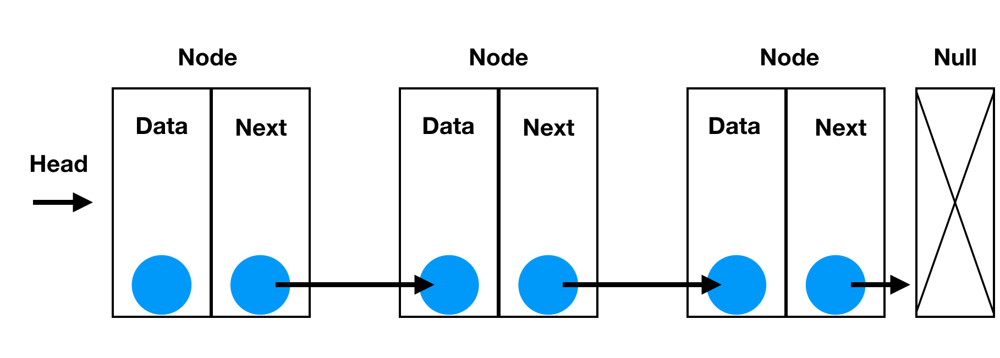

---
{
  "title": "Linked List 鏈結串列",
  "lang": "zH",
  "description": "鏈結串列",
  "meta": [{"name":"keywords", "content":"鏈結串列, linked-list,DataStructure,JavaScript DataStructure"}],
  "tags": ['資料結構']
}
---
# Linked List 鏈結串列

## 比較：串列與陣列
### Array 
#### Array優點
1. 存取只需要O(1)
2. 比linked list 節省空間, 因為不需要指標來記錄下一個節點
#### Array缺點
1. 新增刪除資料麻煩,因為要新增或刪除,其他資料都要全部動過,需要為O(N)
2. 若時常新刪資料,會花費O(N)的時間在搬動資料
#### 適用時機
1. 快速存取資料
2. 已知資料量,不會經常改變陣列大小
3. 要求空間使用少

### Linked List
#### Linked List優點
1. 新刪比Array簡單,只要新刪相關節點,調整指標即可,不需要搬動其餘元素
2. linked list 資料數量能動態像記憶體要空間或釋放空間,不像Array會有重新定義陣列大小的問題

#### Linked List缺點
1. 因為不能透過索引值找某節點,故要找特定節點需要從頭找起,為O(n)
2. 需要額外記憶體來儲存指標
#### 適用時機
1. 無法預期資料量或是需要頻繁變動資料數量時
2. 不需要快速找尋資料

## 串列思考圖


## 建立鏈結串列
### Node的屬性有
1. data 資料
2. next 指向下一個節點
```javascript
class LinkedListNode {
	constructor(ele){
		this.next = null;
		this.ele = ele
	}
}
```
### List 屬性有
1. head 最前面的node是誰
2. length 總共有幾個
```javascript
class Linkedlist {
  constructor(){
    this.length = 0
    this.head = null
  }
}
```


## 鏈結串列>方法 1.append(ele)
### 從尾部新增元素
```javascript
class Linkedlist {
  constructor(){
    this.head = null 
    this.length = 0
  }
  // 從尾巴增加一個
  // 一個可能:原本為空
  // 第二個可能:原本有值
  append(ele){
    // 判斷 nodelist 是不是空的
    let newNode = new LinkedListNode(ele)
    if(this.head == null){ 
      // 1. 是空的
      this.head = newNode  
    }else{
      // 2. 不是空的
      // loop nodelist 到最後一個然後加進去 
      // head 永遠指向第一個
      let current = this.head
      // 最後一個就是 current.next == null
      while(current.next != null){
        // 想像一下,當next有值時,[現在這個current要指向下一個節點]
        current = current.next
      }
      // 找到next為null時,就將next指向新節點
      current.next = newNode
    }
    this.length++
  }
}
```

## 鏈結串列>方法 2.insert(position, ele)
### (從中間插入元素)
```javascript
insert(position, ele) {
    if (position > -1 && position <= this.length) {
        let newNode = new LinkedListNode(ele)
        // 預先設定cur = this.head
        let current = this.head
    
        if (position === 0) {
            // 如果插入到第0個,則新節點的next會指向目前的cur
            newNode.next = current
            // 然後head會指向新節點
            this.head = newNode
        } else {
            let previous
            let index = 0
            // 找position的點
            while (index != position) {
                index++
                // current主要代表現在跑到哪個index
                // 找到前面的串列為何
                previous = current;
                // 找到current的點,串列為何
                current = current.next;
            }
            newNode.next = current
            previous.next = newNode
        }
        this.length++
        return true
    } else {
        return false
    }
}
```

## 鏈結串列>方法 3.removeAt(ele)
### 移除元素
```javascript
	removeAt(position){
		if(position > -1 && position < this.length){
			let current = this.head
			if(position === 0){
				this.head = current.next
			}else{
				let index = 0
				let previous

				while(index != position){
					index++
					previous = current
					current = current.next
				}
				// 主要是這段,前一個的next,指向目前這個的next
				previous.next = current.next
			}
			this.length--
			return this.length
		}else{
			return false
		}
	}
```

## 鏈結串列>方法 4.indexof(ele)
### 查找某元素存不存在
```javascript
indexof(ele){
    // 一樣先初始化
    let index = -1
    let current = this.head
    // 停止狀況為current 為 null
    while(current){
        // 跑進iteration時, index++
        index++
        // 如果相同則return index
        if(current.item === ele){
            return index
        }
        // 不相同則讓current = 下一個節點
        current = current.next
    }
    return -1
}
```

## 鏈結串列>方法 5.remove(ele)
### 移除節點
```javascript
remove(ele){
    let index = this.indexof(ele)
    return this.removeAt(index)
}
```

## 鏈結串列>方法 6.isEmpty()
### 看這個串列是否為空，true代表為空（length === 0）
```javascript
isEmpty(){
    return this.length === 0
}
```

## 鏈結串列>方法 7.size()
### 看這個鏈結串列的大小
```javascript
size(){
    return this.length
}
```

## 鏈結串列>方法 8.toString()
### 將這個鏈結串列通通轉成字串
```javascript
toString(){
    let current = this.head
    let Linkstring = ''

    while(current){
      Linkstring += current.ele
      current = current.next
    }
    return Linkstring
  }
```
