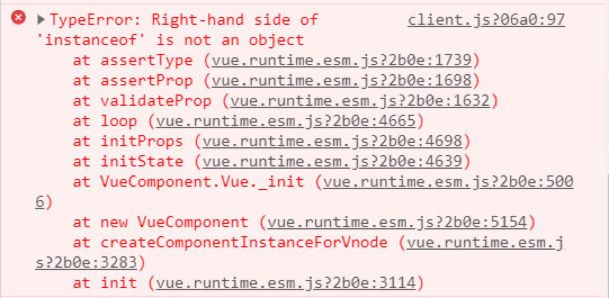

---
{
  "title": "Vue 常見錯誤",
  "lang": "zH",
  "description": "了解Do not mutate vuex store state outside mutation handler,
                    TypeError: Right-hand side of 'instanceof' is not an object,
                    Vue Error: Avoid Mutating a Prop Directly的錯誤原因與改進",
  "meta": [
  {"name":"keywords", "content":"vuex warn, vue props warn"},
  {"name":"author", "content":"Guan Ting Liu"},
  ],
  "tags": ['Vue']
}
---

# Vue 常見錯誤
由於最近在搬專案的關係，常常看到一些錯誤要解，還要google，所以寫了一篇記錄遇見的錯誤

## VueX：直接操作數組錯誤
#### Do not mutate vuex store state outside mutation handler
#### 翻譯：請不要直接操作vuex值
[參考 Vuex 中操作数组，报错 Do not mutate vuex store state outside mutation handler](https://juejin.im/post/6844903903146819597)
```javascript
function getA(){
    let la_groupA = this.$store.state.la_groupA
    // vue在這邊就會報錯，因為妳不可以直接操作vuex state的值
    la_groupA.forEach(data =>{
        data.action_cod = 'D'
    })
}

// 正確做法為下方

function getA(){
    let la_groupA = JSON.parse(JSON.stringify(this.$store.state.la_groupA))
    // vue在這邊就不會報錯，因為你深拷貝了一個數組給這個la_groupA
    la_groupA.forEach(data =>{
        data.action_cod = 'D'
    })
}
```
上面主要是說陣列沒有深拷貝，所以錯誤。那如果是物件就直接使用assign也可以
```javascript
function ObjectDemo(){
    let lo_groupA = Object.assign({}, this.$store.state.lo_groupA)
    // 像這樣使用Object.assign就可以避免掉直接操作這個類別的錯誤
}
```

## props：類別錯誤
#### TypeError: Right-hand side of 'instanceof' is not an object"
#### 翻譯：主要是因為propts的type寫法有問題
[參考 vue坑 TypeError: Right-hand side of 'instanceof' is not an object"](https://www.jianshu.com/p/0c9e90eeba76)

```javascript
props:{
    value: {
    // 記得props這邊這樣是有問題的，不能用''括起來
        type: ['String', 'Number']
    }
}

// 正確做法為下方

props:{
    value: {
    // 這樣給props兩種型別才是對的
        type: [String, Number]
    }
}
```

## props：直接操作 props錯誤
#### Vue Error: Avoid Mutating a Prop Directly
#### 解釋：因為你直接去操作 props的值，所以會有問題（不符合單向資料流）
[參考：How to fix “Avoid mutating a prop directly” in Vue](https://medium.com/javascript-in-plain-english/avoid-mutating-a-prop-directly-7b127b9bca5b)
```javascript
export default {
    props: {
        movies: ['A','B','C']
    },
    methods:{
        pushMovie(){
            // 這邊會有問題，因為你不能直接去更動 props的值
            this.movies.push('D')
        }
    }
}

// 正確做法為下方

export default {
    props: {
        movies: {
            type: Array
            // 我們預設 movies資料為['A','B','C']
        }
    },
    methods:{
        pushMovie(){
            let update_value = 'D'
            // 你必須要打資料上去到父組件，叫父組件更新這個movies才可以
            this.$emit('update-movices',update_value)
        }
    }
}
```
