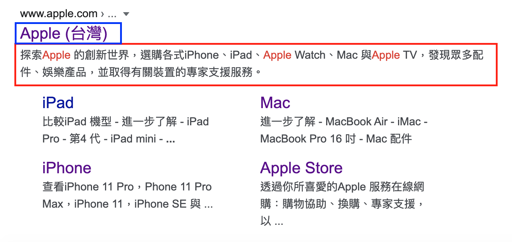

# SEO 優化

## Title
### 一、所謂的title tag
1. 是在HTML中定義網頁標題的工具
2. 也用於搜尋頁的標題
```html
<head>
    <title>SEO的大小事</title>
</head>
```
### 二、會出現的地方
1. 搜尋引擎結果頁
2. 網頁瀏覽器的上面tabpage
3. 社群分享

### 三、理想格式
:::tip
主要關鍵字-次要關鍵字 | 廠牌
:::
1. 25~30個中文字
### 四、每個頁面的title是唯一的


## Lang
### 一、意義與使用方法
1. 當前頁面的語言
```html
<html lang = "zh">
```

## Description
### 一、 意義
1. 對網頁的描述
（紅色框就是description的樣子）
（藍色框就是title）


### 二、字數與規範
1. 提供準確的網頁內容摘要
2. 每個網頁撰寫獨一無二的說明
3. 65-80個中文字

## Meta
### 一、meta keyword
1. 主要用於解釋某個網頁的額外資訊，提供引擎參考

### 二、meta description
1. 對內容的簡述，常見於網站或頁面的介紹。建議加上「主要關鍵字」

## HTML-Tag
### 一、優先權重
#### `<h1> > <h2> > <h3> > <h4> > <h5> > <h6>` 

### 二、建議數量
1. h1 建議一個就好（主要關鍵字）
2. h2-h3 建議二～三個 （次要關鍵字）

## 在Vuepress的用法
```json
{
  "title": "字典與雜湊表",
  "lang": "en-US",
  "description": "hash-table map",
  "meta": [{"name":"A", "content":"B"}],
  "tags": ['資料結構']
}
```
